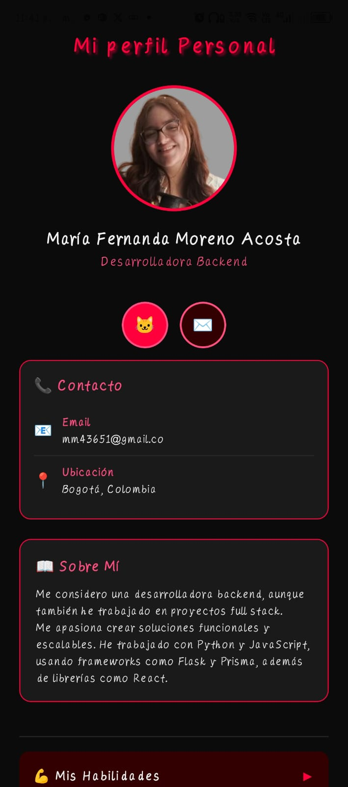
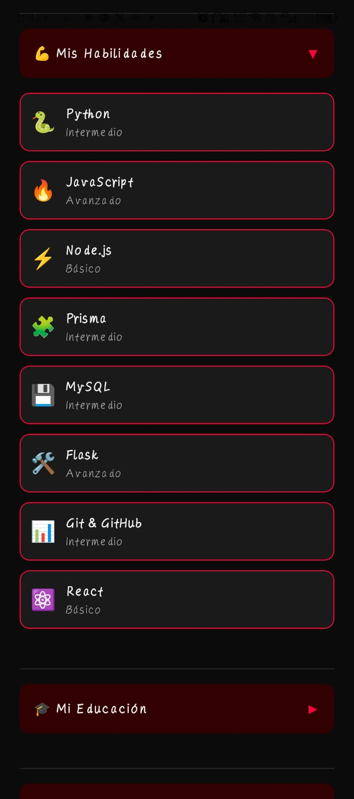
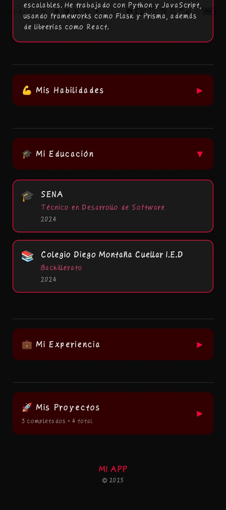
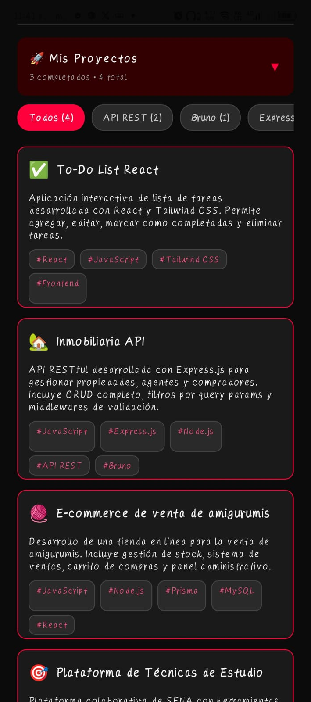
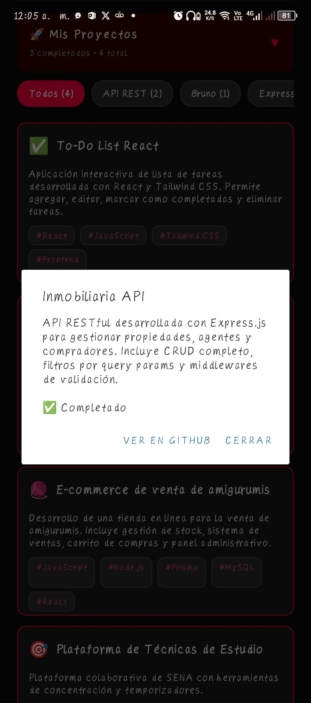

# 📱 Proyecto - Semana 1  
## 🧩 Mi App Personal  
---
### 📘 Descripción General  
**Mi App Personal** es una aplicación desarrollada en **React Native con Expo** como parte del **Proyecto de la Semana 1** del Bootcamp.

El propósito de esta app es integrar todos los conceptos fundamentales vistos durante la primera semana de formación, incluyendo **componentes básicos, diseño con Flexbox, estilos personalizados con StyleSheet, estado local avanzado y renderizado dinámico de listas**.

---
### 🎯 Objetivo del Proyecto  
Construir una aplicación personal completa que contenga:

- Información relevante del desarrollador  
- Habilidades técnicas  
- Educación  
- Experiencia académica/profesional  
- Proyectos personales  

Todo esto dentro de una **única vista scrollable** con secciones colapsables, filtros interactivos y enlaces funcionales.

---
## 🧠 Conceptos Aplicados  
| Concepto | Descripción |
|----------|-------------|
| **Componentes Básicos** | Uso de `View`, `Text`, `Image`, `ScrollView`, `TouchableOpacity` y `SafeAreaView`. |
| **Layouts con Flexbox** | Distribución de elementos con `flexDirection`, `justifyContent`, `alignItems` y `gap`. |
| **Estilos con TailwindCSS** | Aunque no se usan clases directas como `className`, la app aplica una filosofía similar a Tailwind mediante **Nativewind** y estilos personalizados con `StyleSheet`, manteniendo una paleta oscura con acentos en rojo (`#ff003c`) y rosa (`#ff4f81`) para un diseño limpio, coherente y altamente personalizable. |
| **Componentes Reutilizables** | Creación de componentes independientes: `SkillCard`, `ProjectCard`, `ExperienceCard`, `EducationCard`, `CollapsibleSection`. |
| **Renderizado de Listas** | Uso de `map()` para mostrar habilidades, educación, experiencia y proyectos desde arreglos de datos. |
| **Estado Local Avanzado** | Manejo de múltiples estados con `useState` y optimización con `useMemo` para filtros y contadores. |
| **Interactividad** | Alertas contextuales, enlaces a GitHub/Email con `Linking`, y filtros por tecnología en tiempo real. |

---
## 🧩 Estructura del Proyecto  
``` 
├── 📁 assets/ # Íconos y recursos gráficos
├── 📁 components/ # Componentes reutilizables
│ ├── CollapsibleSection.tsx # Secciones colapsables
│ ├── EducationCard.tsx # Tarjeta de educación
│ ├── ExperienceCard.tsx # Tarjeta de experiencia
│ ├── ProjectCard.tsx # Tarjeta de proyecto
│ ├── SkillCard.tsx # Tarjeta de habilidad
├── 📁 img/ # Imagen de perfil
│ └── avatar.jpg
├── App.tsx # Lógica principal y datos
├── styles.ts # Estilos personalizados (tema oscuro)
├── app.json # Configuración de Expo
├── tailwind.config.js # Configuración de Nativewind
├── package.json # Dependencias y scripts
└── README.md # Este archivo
``` 

---
## 🧍‍♀️ Secciones Principales  

### 🧾 1. Perfil  
- Imagen de perfil (avatar)  
- Nombre completo y título profesional  
- Breve biografía personalizada  
- Redes sociales con íconos interactivos (GitHub, Email)

### 💻 2. Habilidades  
- Lista de habilidades técnicas (Python, JavaScript, React, etc.)  
- Cada habilidad incluye ícono, nombre y nivel (Básico/Intermedio/Avanzado)  
- Mostrada en tarjetas con fondo oscuro y acentos en rosa

### 🎓 3. Educación  
- Formación técnica (SENA) y bachillerato  
- Mostrada en tarjetas con ícono, institución, título y año  
- Estilo visual coherente con el resto de la app

### 💼 4. Experiencia  
- Proyectos técnicos del SENA como experiencia profesional  
- Incluye cargo, institución, período y descripción detallada  
- Destaca el desarrollo full stack de un **e-commerce de amigurumis**

### 🚀 5. Proyectos  
- Lista de proyectos personales y académicos  
- Cada proyecto incluye:  
  - Ícono/emoji  
  - Título  
  - Descripción  
  - Etiquetas de tecnología (`#React`, `#Express.js`, etc.)  
  - Estado (✅ Completado / 🚧 En desarrollo)  
  - Enlace a GitHub  
- **Filtros interactivos**: permite filtrar proyectos por tecnología  
- **Contador**: muestra cuántos proyectos están completados

---
## 🧠 Funcionamiento de la App  
1. Al iniciar, se carga una vista scrollable con todas las secciones.  
2. Las secciones **Habilidades, Educación, Experiencia y Proyectos** son **colapsables** (pueden abrirse/cerrarse).  
3. Los **proyectos incluyen filtros horizontales** para navegar por tecnología.  
4. Al tocar un proyecto, se muestra una **alerta con su descripción, estado y enlace a GitHub**.  
5. Los **estilos siguen un tema oscuro personalizado** con acentos en rojo (`#ff003c`) y rosa (`#ff4f81`).  
6. La app es **totalmente responsiva** y funciona en dispositivos iOS y Android mediante **Expo Go**.

🎥 **Video de Funcionamiento:**  
👉 [Ver demo en video](https://drive.google.com/drive/u/1/folders/1MhBoirteGT9v1lNdHglK96sA97yWLTcX) 

---
## 🖼️ Capturas de Pantalla  
| Sección | Vista |
|--------|-------|
| Perfil y redes |  |
| Habilidades expandidas |  |
| Educación expandida |  |
| Experiencia expandida |  |
| Proyectos con filtros |  |
| Alerta de proyecto |  |


---

# ⚙️ Instrucciones de Instalación

## 1. Clona el repositorio
```bash
git clone https://github.com/Fernandam99/Mi_app.git
```

## 2. Ingresa al directorio del proyecto
```bash
cd Mi_app
```

## 3. Instala las dependencias

Este proyecto usa `pnpm` como gestor de paquetes. Si no lo tienes instalado, instálalo primero con:
```bash
npm install -g pnpm
```

Luego, instala las dependencias del proyecto:
```bash
pnpm install
```

## 4. Inicia la aplicación
```bash
npx expo start
```

## 5. Abre en tu dispositivo móvil

- Asegúrate de tener instalada la app **Expo Go** en tu celular (disponible en **Google Play** para Android y en la **App Store** para iOS).
- En la terminal, verás un código QR.
- Ábrelo con la cámara de tu celular (iOS) o con la app Expo Go (Android).
- ¡La app se cargará automáticamente en tu dispositivo!

---

### 💡 Nota

Si usas un iPhone físico, solo puedes ejecutar la app con la versión más reciente de Expo Go, que soporta SDK 54 (tu app ya está en esa versión).

## 🧑‍💻 Autor

**María Fernanda Moreno Acosta**

📅 **Fecha:** Noviembre 2025

🎴 **Ficha:** 3147235

Desarrolladora en formación | SENA

🌐 **GitHub:** [fernandam99](https://github.com/fernandam99)

---

## 🏁 Conclusión

Este proyecto representa el primer paso en la construcción de aplicaciones móviles con React Native y Expo, aplicando las bases de diseño, estructura de componentes, gestión de estado y experiencia de usuario.

La app no solo es funcional, sino que también refleja mi identidad como desarrolladora: con un enfoque en el backend, proyectos full stack reales (como el e-commerce de amigurumis) y una estética visual coherente y personalizada.

Es completamente personalizable, escalable y lista para incluir futuras secciones o mejoras.